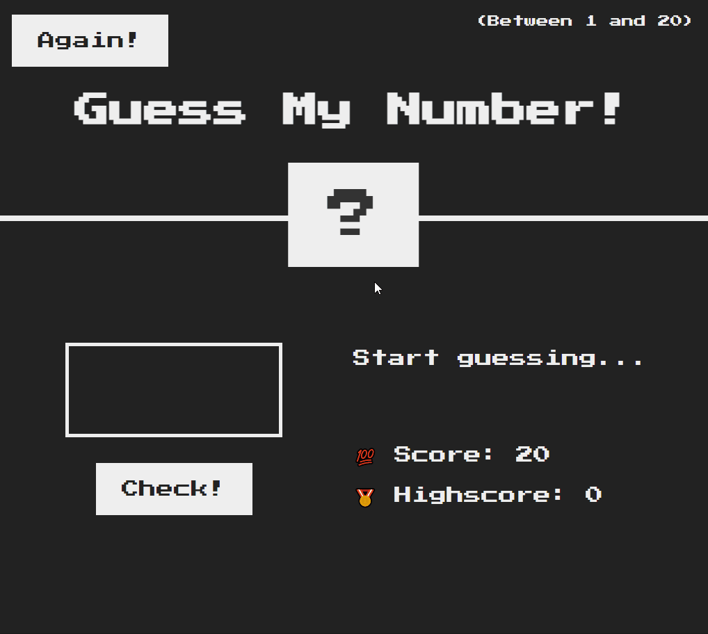
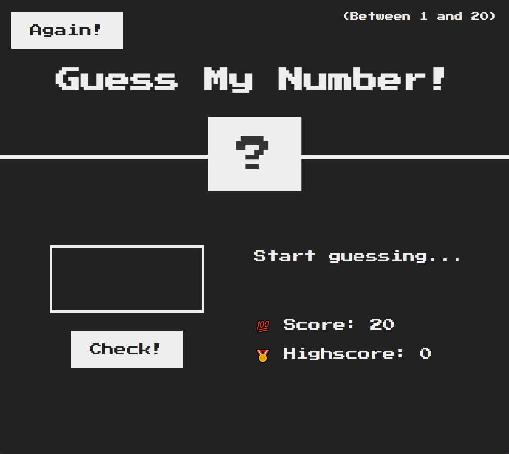

<h1 style="text-align: center; font-weight: bold;">Guess my number (Adivinhe meu número)!</h1>

<h1>Introdução</h1>

Esse é um projeto de um jogo com muitas funcionalidades.

 <a href="#sobre">Sobre</a> •
 <a href="#demonstração">Demonstração</a> •

## Sobre

Como o nome diz, o projeto é um jogo com o objetivo de acertar o número escondido com menor número de tentativas possíveis(score). 
Projeto com botões de para checar se é o número certo, de jogar de novo e com muita interatividade.

## Demonstração

## Feito por Thiago  